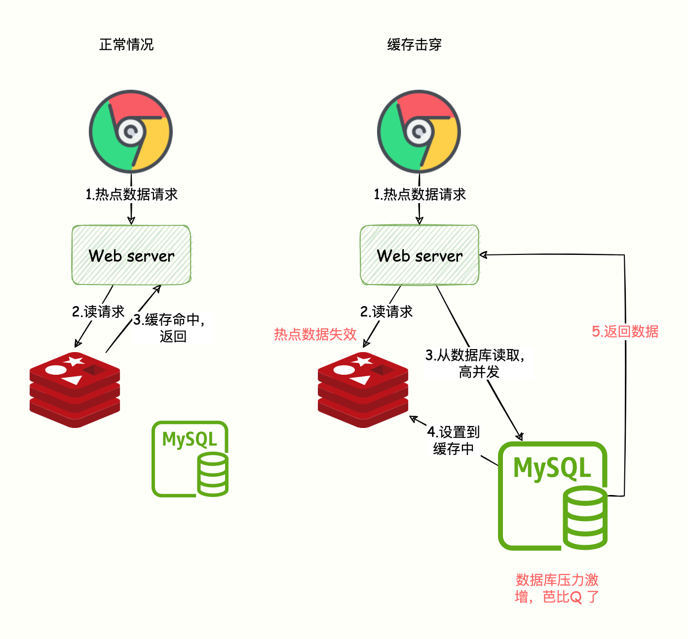
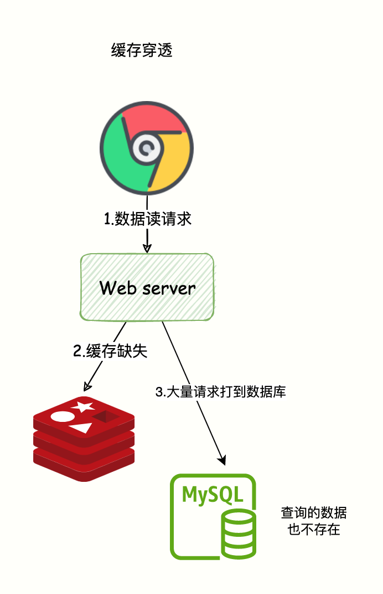
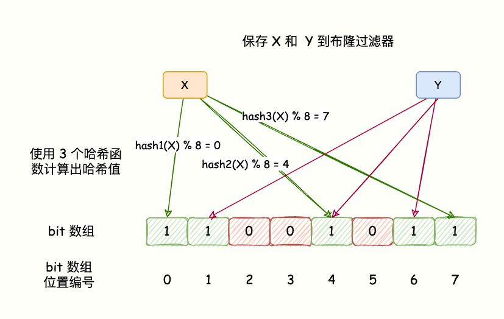

- [1 缓存简介](#1-缓存简介)
- [2 缓存击穿](#2-缓存击穿)
  - [2.1 现象](#21-现象)
  - [2.2 解决方案](#22-解决方案)
    - [2.2.1 使用锁](#221-使用锁)
- [3 缓存穿透](#3-缓存穿透)
  - [3.1 现象](#31-现象)
  - [3.2 解决方案](#32-解决方案)
    - [3.2.1 缓存空值](#321-缓存空值)
    - [3.2.2 布隆过滤器](#322-布隆过滤器)
- [4 缓存雪崩](#4-缓存雪崩)
  - [4.2 缓存大量数据同时过期](#42-缓存大量数据同时过期)
    - [4.2.1 现象](#421-现象)
    - [4.2.2 解决方案](#422-解决方案)
  - [4.3 Redis 故障宕机](#43-redis-故障宕机)
    - [4.3.1 现象](#431-现象)
    - [4.3.2 解决方案](#432-解决方案)
- [5 总结](#5-总结)

## 1 缓存简介
- 当请求进来的时候，先从缓存中取数据，如果有则直接返回缓存中的数据。
- 如果缓存中没数据，就去数据库中读取数据并写到缓存中，再返回结果。

缓存设计不当，将会导致严重后果，本文将介绍缓存使用中常见的三个问题和解决方案：
- 缓存击穿（失效）；
- 缓存穿透；
- 缓存雪崩。

## 2 缓存击穿
### 2.1 现象
- 高并发流量，访问的这个数据是热点数据，请求的数据在 DB 中存在，但是 Redis 存的那一份**已经过期**，后端需要从 DB 加载数据并写到 Redis。
- 关键字：单一热点数据、高并发、数据失效

但是由于高并发，可能会把 DB 压垮，导致服务不可用。如下图所示：

### 2.2 解决方案
#### 2.2.1 使用锁
- 当发现缓存失效的时候，不是立即从数据库加载数据。而是先获取**分布式锁**，获取锁成功才执行数据库查询和写数据到缓存的操作，获取锁失败，则说明当前有线程在执行数据库查询操作，当前线程睡眠一段时间在重试。
- 这样只让一个请求去数据库读取数据。

## 3 缓存穿透
### 3.1 现象
- 缓存穿透：意味着有特殊请求在查询一个不存在的数据，即**数据不存在 Redis 也不存在于数据库**
- 导致每次请求都会穿透到数据库，缓存成了摆设，对数据库产生很大压力从而影响正常服务。

### 3.2 解决方案
#### 3.2.1 缓存空值
**缓存空值**：当请求的数据不存在 Redis 也不存在数据库的时候，设置一个缺省值（比如：None）。当后续再次进行查询则直接返回空值或者缺省值。

#### 3.2.2 布隆过滤器
**布隆过滤器**：在数据写入数据库的同时将这个 ID 同步到布隆过滤器中，当请求的 id 不存在布隆过滤器中则说明该请求查询的数据一定没有在数据库中保存，就不要去数据库查询了。

布隆过滤器的原理：
- BloomFilter 的算法是，首先分配一块内存空间做 bit 数组，数组的 bit 位初始值全部设为 0。
- 加入元素时，采用 k 个相互独立的 Hash 函数计算，然后将元素 Hash 映射的 K 个位置全部设置为 1。
- 检测 key 是否存在，仍然用这 k 个 Hash 函数计算出 k 个位置，如果位置全部为 1，则表明 key 存在，否则不存在。

- 哈希函数会出现碰撞，所以布隆过滤器会存在误判。
- 这里的误判率是指，BloomFilter 判断某个 key 存在，但它实际不存在的概率，因为它存的是 key 的 Hash 值，而非 key 的值。所以有概率存在这样的 key，它们内容不同，但多次 Hash 后的 Hash 值都相同。
- 对于 BloomFilter 判断不存在的 key ，则是 100% 不存在的，反证法，如果这个 key 存在，那它每次 Hash 后对应的 Hash 值位置肯定是 1，而不会是 0。布隆过滤器判断存在不一定真的存在。

## 4 缓存雪崩
缓存雪崩指的是大量的请求无法在 Redis 缓存系统中处理，请求全部打到数据库，导致数据库压力激增，甚至宕机。
出现该原因主要有两种：
- 大量热点数据同时过期，导致大量请求需要查询数据库并写到缓存；
- Redis 故障宕机，缓存系统异常。

### 4.2 缓存大量数据同时过期
#### 4.2.1 现象
- 数据保存在缓存系统并设置了过期时间，但是由于在同时一刻，大量数据同时过期。系统就把请求全部打到数据库获取数据，并发量大的话就会导致数据库压力激增。
- 缓存雪崩是发生在大量数据同时失效的场景，而缓存击穿（失效）是在某个**热点数据失效**的场景，这是他们最大的区别。
#### 4.2.2 解决方案
- 过期时间添加随机值
要避免给大量的数据设置一样的过期时间，过期时间 = baes 时间 + 随机时间（较小的随机数，比如随机增加 1~5 分钟）。
这样一来，就不会导致同一时刻热点数据全部失效，同时过期时间差别也不会太大，既保证了相近时间失效，又能满足业务需求。

- 接口限流
当访问的不是核心数据的时候，在查询的方法上加上接口限流保护。比如设置 10000 req/s。
如果访问的是核心数据接口，缓存不存在允许从数据库中查询并设置到缓存中。
这样的话，只有部分请求会发送到数据库，减少了压力。

**限流**，就是指，我们在业务系统的请求入口前端控制每秒进入系统的请求数，避免过多的请求被发送到数据库。

### 4.3 Redis 故障宕机
#### 4.3.1 现象
- 一个 Redis 实例能支撑 10 万的 QPS，而一个数据库实例只有 1000 QPS。
- 一旦 Redis 宕机，会导致大量请求打到数据库，从而发生缓存雪崩。

#### 4.3.2 解决方案
对于缓存系统故障导致的缓存雪崩的解决方案有两种：
- 服务熔断和接口限流；
- 构建高可用缓存集群系统。

**服务熔断和限流：**
- 在业务系统中，针对高并发的使用服务熔断来有损提供服务从而保证系统的可用性。
- **服务熔断**就是当从缓存获取数据发现异常，则直接返回错误数据给前端，防止所有流量打到数据库导致宕机。
- **服务熔断和限流**属于在发生了缓存雪崩，如何降低雪崩对数据库造成的影响的方案。

**构建高可用的缓存集群：**
所以，缓存系统一定要构建一套 Redis 高可用集群，比如 [《Redis 哨兵集群》](https://mp.weixin.qq.com/s/m3j2WZdFas8fjLRsykGcBQ)或者 [《Redis Cluster 集群》](https://mp.weixin.qq.com/s/qOF9hT_gDvkMH6HbaIvBwg)，如果 Redis 的主节点故障宕机了，从节点还可以切换成为主节点，继续提供缓存服务，避免了由于缓存实例宕机而导致的缓存雪崩问题。
## 5 总结
- **缓存击穿(失效)**：指的是数据库有数据，缓存本应该也有数据，但是缓存过期了，Redis 这层流量防护屏障被击穿了，请求直奔数据库。
- **缓存穿透**指的是数据库本就没有这个数据，请求直奔数据库，缓存系统形同虚设。
- **缓存雪崩**指的是大量的热点数据无法在 Redis 缓存中处理（大面积热点数据缓存失效、Redis 宕机），流量全部打到数据库，导致数据库极大压力。