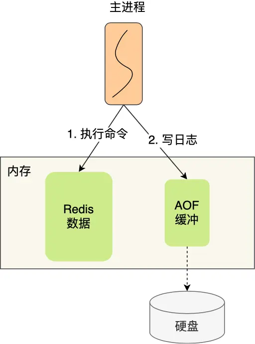
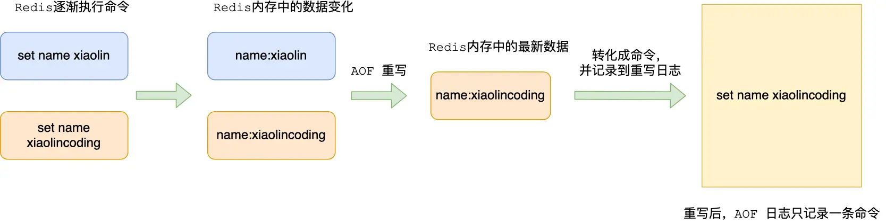

## 简介
- redis 共有两种持久化技术：AOF 和 RDB
- redis 默认使用 RDB
- AOF(Append Only File) 记录写操作命令，不会记录读操作命令
  - 每执行一条写操作命令，就将该命令以追加的方式写入到 AOF 文件，然后在恢复时，以逐一执行命令的方式来进行数据恢复
- Redis 提供了三种将 AOF 日志写回硬盘的策略，分别是 Always、Everysec 和 No，这三种策略在可靠性上是从高到低，而在性能上则是从低到高
- 为了避免日志文件过大， Redis 提供了 AOF 重写机制，它会直接扫描数据中所有的键值对数据，然后为每一个键值对生成一条写操作命令，接着将该命令写入到新的 AOF 文件，重写完成后，就替换掉现有的 AOF 日志。重写的过程是由后台子进程完成的，这样可以使得主进程可以继续正常处理命令。
- 用 AOF 日志的方式来恢复数据其实是很慢的，因为 Redis 执行命令由单线程负责的，而 AOF 日志恢复数据的方式是顺序执行日志里的每一条命令，如果 AOF 日志很大，这个「重放」的过程就会很慢了

## aof 工作流程
- 将命令写入到日志是在主进程完成的（执行命令也是在主进程）
- Redis 是先执行写操作命令后，才将该命令记录到 AOF 日志

### 先执行写操作后记录 AOF 的优缺点
#### 优点
- 避免额外的检查开销
  - 如果先将写操作命令记录到 AOF 日志里，再执行该命令的话，如果当前的命令语法有问题，该错误的命令记录到 AOF 日志里后，Redis 在使用日志恢复数据时，可能会出错。
  - 如果先执行写操作命令再记录日志的话，只有在该命令执行成功后，才将命令记录到 AOF 日志里，这样就不用额外的检查开销，保证记录在 AOF 日志里的命令都是可执行并且正确的。
- 不会阻塞当前写操作命令的执行
  - 当写操作命令执行成功后，才会将命令记录到 AOF 日志。

#### 缺点
- 数据就会有丢失的风险
  - 执行写操作命令和记录日志是两个过程，那当 Redis 在还没来得及将命令写入到硬盘时，服务器发生宕机了，这个数据就会有丢失的风险
- 可能会给「下一个」命令带来阻塞风险

### aof 配置
- 在 Redis 中 AOF 持久化功能默认是不开启的，需要我们修改 redis.conf 配置文件中的以下参数:

#### aof 文件内容
- AOF 日志文件为普通的文本，可以通过 cat 命令查看里面的内容
- 「set name xiaolin」命令作为例子，Redis 执行了这条命令后，记录在 AOF 日志里的内容如下图：

- 「*3」表示当前命令有三个部分，每部分都是以「$+数字」开头，后面紧跟着具体的命令、键或值。
- $ 后的「数字」表示这部分中的命令、键或值一共有多少字节。例如，「$3 set」表示这部分有 3 个字节，也就是「set」命令这个字符串的长度。

## aof 的三种刷盘策略
### 写入硬盘的过程
- Redis 执行完写操作命令后，会将命令追加到 server.aof_buf 缓冲区； 
- 然后通过 write() 系统调用，将 aof_buf 缓冲区的数据写入到 AOF 文件，此时数据并没有写入到硬盘，而是拷贝到了内核缓冲区 page cache，等待内核将数据写入硬盘； 
- 具体内核缓冲区的数据什么时候写入到硬盘，由内核决定。

- Redis 提供了 3 种写回硬盘的策略，控制的就是上面说的第三步的过程。
### 三种策略对比
- 三种策略只是在控制 fsync() 函数的调用时机

|写回策略|说明|实现方式|写回时机|优点|缺点|
|---|---|---|---|---|---|
|always|每次写操作命令执行完后，同步将 AOF 日志数据写回硬盘|每次写入 AOF 文件数据后，就执行 fsync() 函数|同步写回|可靠性高、最大程度保证数据不丢失|每个命令都要实时写回硬盘，性能开销大|
|everysec|每次写操作命令执行完后，先将命令写入到 AOF 文件的内核缓冲区，然后每隔一秒将缓冲区里的内容写回到硬盘|创建一个异步任务来执行 fsync() 函数|每秒写回|性能适中|宕机时会丢失 1 秒数据|
|no|不由 Redis 控制写回硬盘的时机，转交给操作系统控制写回的时机，也就是每次写操作命令执行完后，先将命令写入到 AOF 文件的内核缓冲区，再由操作系统决定何时将缓冲区内容写回硬盘。|永不执行 fsync() 函数|操作系统控制写回|性能好|宕机时丢失数据可能会很多|

## aof 重写
- AOF 日志是一个文件，随着执行的写操作命令越来越多，文件的大小会越来越大
- 如果 AOF 日志文件过大就会带来性能问题，比如重启 Redis 后，需要读 AOF 文件的内容以恢复数据，如果文件过大，整个恢复的过程就会很慢。
- 所以，Redis 为了避免 AOF 文件越写越大，提供了 AOF 重写机制，当 AOF 文件的大小超过所设定的阈值后，Redis 就会启用 AOF 重写机制，来压缩 AOF 文件。
- AOF 重写机制是在重写时，读取当前数据库中的所有键值对，然后将**每一个键值对用一条命令**记录到「新的 AOF 文件」，等到全部记录完后，就将新的 AOF 文件替换掉现有的 AOF 文件。
### 重写机制
- AOF 重写机制是在重写时，读取当前数据库中的所有键值对，然后将**每一个键值对用一条命令**记录到「新的 AOF 文件」，等到全部记录完后，就将新的 AOF 文件替换掉现有的 AOF 文件。
- 尽管某个键值对被多条写命令反复修改，最终也只需要根据这个「键值对」当前的最新状态，然后用一条命令去记录键值对，代替之前记录这个键值对的多条命令
例如：
- 在没有使用重写机制前，假设前后执行了「set name xiaolin」和「set name xiaolincoding」这两个命令的话，就会将这两个命令记录到 AOF 文件。
- 在使用重写机制后，就会读取 name 最新的 value（键值对） ，然后用一条 「set name xiaolincoding」命令记录到新的 AOF 文件
- 之前的第一个命令就没有必要记录了，因为它属于「历史」命令，没有作用了。这样一来，一个键值对在重写日志中只用一条命令就行了
- 重写工作完成后，就会将新的 AOF 文件覆盖现有的 AOF 文件，这就相当于压缩了 AOF 文件，使得 AOF 文件体积变小了。
- 在通过 AOF 日志恢复数据时，只用执行这条命令，就可以直接完成这个键值对的写入了

为什么重写 AOF 的时候，不直接复用现有的 AOF 文件，而是先写到新的 AOF 文件再覆盖过去？
- 如果 AOF 重写过程中失败了，现有的 AOF 文件就会造成污染，可能无法用于恢复使用
- 所以 AOF 重写过程，先重写到新的 AOF 文件，重写失败的话，就直接删除这个文件就好，不会对现有的 AOF 文件造成影响。

### 后台重写
- aof 重写是很耗时的，所以重写的操作不能放在主进程里
- 重写 AOF 过程是由后台子进程 bgrewriteaof 来完成的
#### 后台重写机制
- 重写 AOF 过程是由后台子进程 bgrewriteaof 来完成的
  - 子进程进行 AOF 重写期间，主进程可以继续处理命令请求，从而避免阻塞主进程
  - 子进程带有主进程的数据副本，
    - 这里使用子进程而不是线程，因为如果是使用线程，多线程之间会共享内存，那么在修改共享内存数据的时候，需要通过加锁来保证数据的安全，而这样就会降低性能
    - 而使用子进程，创建子进程时，父子进程是共享内存数据的，不过这个共享的内存只能以只读的方式，而当父子进程任意一方修改了该共享内存，就会发生「写时复制」，于是父子进程就有了独立的数据副本，就不用加锁来保证数据安全
- 子进程重写过程中，主进程依然可以正常处理命令

1) **复制页表**
- 主进程在通过 fork 系统调用生成 bgrewriteaof 子进程时，操作系统会把主进程的「页表」复制一份给子进程，这个页表记录着虚拟地址和物理地址映射关系，而不会复制物理内存，也就是说，两者的虚拟空间不同，但其对应的物理空间是同一个。
- 子进程共享父进程的物理内存数据，页表对应的页表项的属性会标记该物理内存的权限为只读
- 操作系统复制父进程页表的时候，父进程是阻塞中的

2) **写保护中断**
- 当父进程或者子进程在向这个内存发起写操作时，CPU 就会触发写保护中断，这个写保护中断是由于违反权限导致的
- 然后操作系统会在「写保护中断处理函数」里进行物理内存的复制，并重新设置其内存映射关系，将父子进程的内存读写权限设置为可读写
- 最后才会对内存进行写操作，这个过程被称为「写时复制(Copy On Write)」

- 在发生写操作的时候，操作系统才会去复制物理内存
- 防止 fork 创建子进程时，由于物理内存数据的复制时间过长而导致父进程长时间阻塞的问题
- 主进程修改了已经存在 key-value，就会发生写时复制，注意这里只会复制主进程修改的物理内存数据，没修改物理内存还是与子进程共享的

3) **重写缓冲区**
重写 AOF 日志过程中，如果主进程修改了已经存在 key-value，此时这个 key-value 数据在子进程的内存数据就跟主进程的内存数据不一致了，这时要怎么办呢？
- 为了解决这种数据不一致问题，Redis 设置了一个 AOF 重写缓冲区，这个缓冲区在创建 bgrewriteaof 子进程之后开始使用
- 在重写 AOF 期间，当 Redis 执行完一个写命令之后，它会同时将这个写命令写入到 「AOF 缓冲区」和 「AOF 重写缓冲区」。

- 在 bgrewriteaof 子进程执行 AOF 重写期间，主进程需要执行以下三个工作:
  - 执行客户端发来的命令； 
  - 将执行后的写命令追加到 「AOF 缓冲区」； 
  - 将执行后的写命令追加到 「AOF 重写缓冲区」；
- 当子进程完成 AOF 重写工作（扫描数据库中所有数据，逐一把内存数据的键值对转换成一条命令，再将命令记录到重写日志）后，会向主进程发送一条信号
- 主进程收到该信号后，会调用一个信号处理函数，该函数主要做以下工作:
  - 将 AOF 重写缓冲区中的所有内容追加到新的 AOF 的文件中，使得新旧两个 AOF 文件所保存的数据库状态一致；
  - 新的 AOF 的文件进行改名，覆盖现有的 AOF 文件。
  - 信号函数执行完后，主进程就可以继续像往常一样处理命令了。

## 主进程阻塞
- 创建子进程的途中，由于要复制父进程的页表等数据结构，阻塞的时间跟页表的大小有关，页表越大，阻塞的时间也越长； 
- 创建完子进程后，如果子进程或者父进程修改了共享数据，就会发生写时复制，这期间会拷贝物理内存，如果内存越大，自然阻塞的时间也越长；
- 信号处理函数执行时也会对主进程造成阻塞

## 相关链接
- [AOF 持久化是怎么实现的？](https://www.xiaolincoding.com/redis/storage/aof.html#aof-%E6%97%A5%E5%BF%97)
