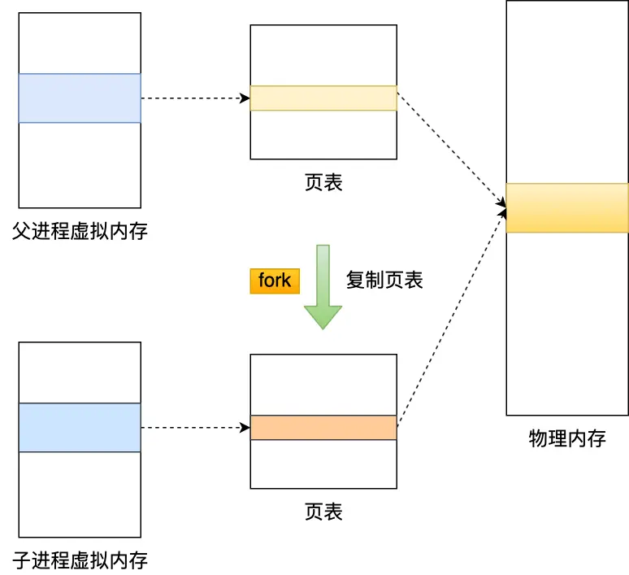
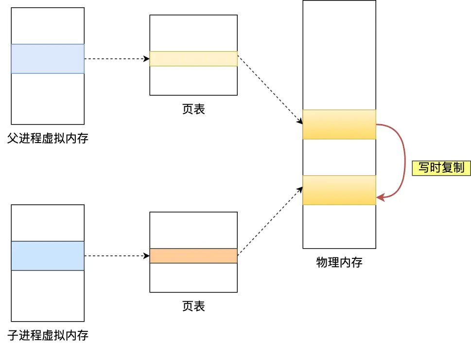
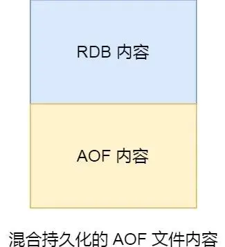

## 简介
- AOF 文件的内容是操作命令；
  - AOF 文件记录的是命令操作的日志，而不是实际的数据
- RDB 文件的内容是二进制数据。
  - RDB 快照就是记录某一个瞬间的内存数据，记录的是实际数据
- 在 Redis 恢复数据时， RDB 恢复数据的效率会比 AOF 高些，
  - 因为直接将 RDB 文件读入内存就可以，不需要像 AOF 那样还需要额外执行操作命令的步骤才能恢复数据
- RDB 文件的加载工作是在服务器启动时自动执行的，Redis 并没有提供专门用于加载 RDB 文件的命令
- Redis 的快照是**全量快照**，也就是说每次执行快照，都是把内存中的「所有数据」都记录到磁盘中
  - 所以可以认为，执行快照是一个比较重的操作
  - 如果频率太频繁，可能会对 Redis 性能产生影响
  - 如果频率太低，服务器故障时，丢失的数据会更多
  - 通常设置至少 5 分钟才保存一次快照
- 在服务器发生故障时，丢失的数据会比 AOF 持久化的方式更多
  - 因为 RDB 快照是全量快照的方式，执行的频率不能太频繁，而 AOF 日志可以以秒级的方式记录操作命令，所以丢失的数据就相对更少

## save 和 bgsave
- Redis 提供了两个命令来生成 RDB 文件，分别是 save 和 bgsave，他们的区别就在于是否在「主线程」里执行：
  - 执行 save 命令，就会在主线程生成 RDB 文件，由于和执行操作命令在同一个线程，所以如果写入 RDB 文件的时间太长，会阻塞主线程；
  - 执行 bgsave 命令，会创建一个子进程来生成 RDB 文件，这样可以避免主线程的阻塞
- RDB 文件的加载工作是在服务器启动时自动执行的，Redis 并没有提供专门用于加载 RDB 文件的命令
- Redis 还可以通过配置文件的选项来实现**每隔一段时间自动执行一次 bgsave 命令**，默认会提供以下配置：
```shell
# 只要满足下面条件的任意一个，就会执行 bgsave 生成 RDB 快照

# 900 秒之内，对数据库进行了至少 1 次修改
save 900 1

# 300 秒之内，对数据库进行了至少 10 次修改
save 300 10

# 60 秒之内，对数据库进行了至少 10000 次修改
save 60 10000

```

## 工作机制
- Redis 的快照是**全量快照**，也就是说每次执行快照，都是把内存中的「所有数据」都记录到磁盘中
  - 所以可以认为，执行快照是一个比较重的操作
  - 如果频率太频繁，可能会对 Redis 性能产生影响
  - 如果频率太低，服务器故障时，丢失的数据会更多
- 通常设置至少 5 分钟才保存一次快照，如果 Redis 出现宕机等情况，则意味着最多可能丢失 5 分钟数据

### bgsave 执行中修改数据
- 执行 bgsave 过程中，子进程构建 RDB 文件，主线程还是可以继续工作的
- 执行 bgsave 过程中，Redis 依然可以继续处理操作命令，也就是数据是能被修改的。
  - 使用写时复制技术（Copy-On-Write, COW）实现

**bgsave 的执行：**
1) 创建子进程
- 执行 bgsave 命令的时候，通过 fork() 创建子进程，
- 此时子进程和父进程是共享同一片内存数据的，
  - 因为创建子进程的时候，会复制父进程的页表，但是页表指向的物理内存还是一个。


2) 复制内存
- 如果主线程（父进程）要修改共享数据里的某一块数据（比如键值对 A）时，就会发生写时复制，
- 这块数据的物理内存就会被复制一份（键值对 A'），然后主线程在这个数据副本（键值对 A'）进行修改操作。
- 与此同时，bgsave 子进程可以继续把原来的数据（键值对 A）写入到 RDB 文件
- Redis 在使用 bgsave 快照过程中，如果主线程修改了内存数据，不管是否是共享的内存数据，RDB 快照都无法写入主线程刚修改的数据
  - 如果系统恰好在 RDB 快照文件创建完毕后崩溃了，那么 Redis 将会丢失主线程在快照期间修改的数据
- 如果所有的共享内存都被修改，则此时的内存占用是原先的 2 倍
- 针对写操作多的场景，我们要留意下快照过程中内存的变化，防止内存被占满了


## rdb 与 aof 混合使用
尽管 RDB 比 AOF 的数据恢复速度快，但是快照的频率不好把握：
- 如果频率太低，两次快照间一旦服务器发生宕机，就可能有比较多的数据丢失
- 如果频率太高，频繁写入磁盘和创建子进程会带来额外的性能开销

### 混合持久化
- 将 RDB 和 AOF 合体使用，这个方法是在 Redis 4.0 提出的，该方法叫混合使用 AOF 日志和内存快照，也叫**混合持久化**
- 混合持久化工作在 AOF 日志重写过程


**混合持久化过程：**
- 在 AOF 重写日志时，fork 出来的重写子进程会先将与主线程共享的内存数据以 RDB 方式写入到 AOF 文件，
- 然后主线程处理的操作命令会被记录在重写缓冲区里，
- 重写缓冲区里的增量命令会以 AOF 方式写入到 AOF 文件
- 写入完成后通知主进程将新的含有 RDB 格式和 AOF 格式的 AOF 文件替换旧的的 AOF 文件。

混合持久化，AOF 文件的前半部分是 RDB 格式的全量数据，后半部分是 AOF 格式的增量数据。
- 这样的好处在于，重启 Redis 加载数据的时候，由于前半部分是 RDB 内容，这样加载的时候速度会很快。
- 加载完 RDB 的内容后，才会加载后半部分的 AOF 内容，这里的内容是 Redis 后台子进程重写 AOF 期间，主线程处理的操作命令，可以使得数据更少的丢失


### 混合持久化配置
- 如果要开启混合持久化功能，需要在 Redis 配置文件将下面这个配置项设置成 yes：
```shell
aof-use-rdb-preamble yes
```


## 相关链接
- [RDB 快照是怎么实现的？](https://www.xiaolincoding.com/redis/storage/rdb.html#%E5%BF%AB%E7%85%A7%E6%80%8E%E4%B9%88%E7%94%A8)
