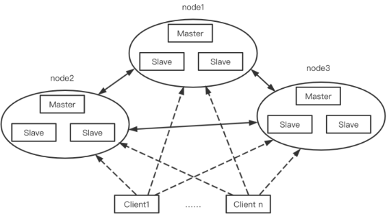

# Redis分片模式

## 1 简介
分片模式也即Redis-Cluster集群

Redis的哨兵模式基本已经可以实现高可用，读写分离 ，但是在这种模式下每台redis服务器都存储相同的数据，很浪费内存，所以在redis3.0上加入了cluster模式，实现的redis的分布式存储，也就是说每台redis节点上存储不同的内容。 
Redis-Cluster采用无中心结构,为多主多从结构，它的特点如下：
* 所有的redis节点彼此互联(PING-PONG机制),内部使用二进制协议优化传输速度和带宽。
* 节点的fail是通过集群中超过半数的节点检测失效时才生效。

## 2 工作方式
Redis Cluster 是 Redis 提供的分布式集群方案，通过分片和数据复制实现了数据的水平扩展和高可用性。下面是 Redis Cluster 的工作原理：

1） **数据分片（Sharding）：**
   - Redis Cluster 将所有的数据分布在16384个槽位中，每个槽位可以存储一部分数据。这些槽位会被分配给集群中的主节点。
   - 使用 CRC16 算法对键（key）进行计算，然后对16384取模，得到的结果就是该键应该存储的槽位。

2） **节点间通信：**
   - 在 Redis Cluster 中，每个节点要么是主节点（master），要么是从节点（slave）。主节点负责处理写操作，而从节点复制主节点的数据并可以处理读操作。从节点拥有主节点的全部数据，作为主节点故障时的备用。
   - Redis集群的故障检测是基于gossip协议的，集群中的每个节点都会定期地向集群中的其他节点发送PING消息，以此交换各个节点状态信息

3） **故障检测和自动故障转移：**
   - 当一个主节点发生故障时，它的从节点之一会被提升为新的主节点，并接管原主节点负责的槽位。

4）**数据迁移**
   - Redis Cluster 支持在线进行数据迁移（resharding），即在不停止服务的情况下，将数据从一个节点迁移到另一个节点，以此来平衡负载或调整槽位的分配。

5）**请求路由**
  - **槽位定位**：
     客户端首先根据键（key）计算出它所属的槽位（hash slot）。Redis Cluster 通过 CRC16 算法对键进行哈希，然后将哈希值对16384取模，得到的结果就是该键对应的槽位。

  - **槽位到节点的映射**：
     客户端需要知道每个槽位当前映射到哪个节点。这种映射信息可以通过集群的元数据获得，通常客户端在初始化连接时会从集群中的任一节点获取整个集群的槽位映射信息。

  - **请求发送**：
     一旦确定了键所在的槽位，客户端就会将请求发送到负责该槽位的主节点。

  - **重定向（Redirect）**：
     如果客户端尝试将请求发送到错误的节点（即不负责该槽位的节点），该节点会返回一个错误响应，通常是 `MOVED` 错误，其中包含了正确的节点信息。客户端接收到 `MOVED` 错误后，会更新其槽位到节点的映射信息，并重新向正确的节点发送请求。

  - **集群状态更新**：
     客户端可能需要定期更新集群的槽位映射信息，以响应集群中节点的变化，如故障转移或槽位迁移。

  - **读写分离**：
     对于读请求，客户端可以选择将请求发送到任意可用的从节点以负载均衡。如果读请求被发送到了主节点，主节点会将请求转发到相应的从节点。

  - **故障转移期间的路由**：
     在故障转移期间，集群中的其他节点会协商选举出新的主节点来替代故障的主节点。在新的主节点被选举出来并接管了原主节点的槽位之后，客户端的请求路由信息也需要更新。

  - **客户端库支持**：
     许多 Redis 客户端库已经内置了对 Redis Cluster 的支持，能够自动处理槽位计算、错误处理和重定向等逻辑。
## 3 优缺点

### 3.1 优点：

1） **高可用性**：Redis Cluster 支持主从复制和故障转移，可以在主节点故障时自动将主节点的角色转移到从节点，从而实现高可用性。

2） **可扩展性**：Redis Cluster 通过数据分片（Sharding）存储在多个节点上，可以水平扩展以应对海量数据和高并发的场景。

3） **高性能**：Redis Cluster 的性能与单节点部署是同级别的，它采用了优化的内部二进制协议，减少了网络开销。

4） **动态扩容**：可以在线添加或移除节点，进行数据的重新分片（resharding），而不需要停止服务。

5） **去中心化**：Redis Cluster 采用 P2P 模式，完全去中心化，每个节点都保存数据和集群状态信息，没有单点故障的风险。

6） **数据分区**：集群共有16384个槽（slots），每个节点负责其中的一部分，数据根据计算出的槽位分配到相应的节点上。

### 3.2 缺点：

1） **客户端复杂性**：客户端实现复杂，需要缓存slots mapping信息并及时更新，提高了开发难度。

2） **数据通过异步复制**：不保证数据的强一致性，可能会在故障转移期间导致数据不一致。

3） **有限的批量操作支持**：目前只支持具有相同slot值的key执行批量操作，对mset、mget、sunion等操作支持不友好。

4） **不支持多数据库空间**：与单机Redis相比，集群模式下只能使用一个数据库空间，即db 0。

5） **故障转移限制**：如果主节点和它的从节点都宕机了，那么该集群就无法再提供服务了，需要依赖外部监控系统。

6） **节点数量限制**：集群节点数量基本不可能超过1000个，节点越多，心跳包的消息体内携带的数据越多，可能导致网络拥堵。

7） **不支持pipeline和multi-keys操作**：Redis Cluster 不建议使用pipeline和multi-keys操作，以减少max redirect产生的场景。

8） **事务限制**：只支持多key在同一节点的事务操作，多key分布不同节点时无法使用事务功能。

## 4 相关链接
- [Redis集群原理详解](https://blog.csdn.net/a745233700/article/details/112691126)
