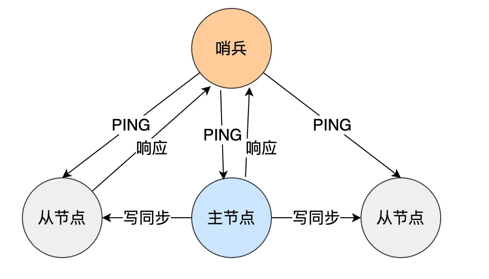
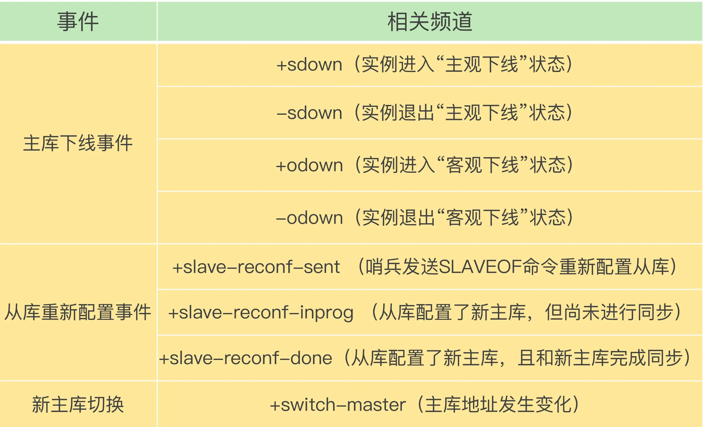

## 哨兵模式简介
### 哨兵模式背景
- 在 Redis 的主从架构中，由于主从模式是读写分离的，如果主节点（master）挂了，那么将没有主节点来服务客户端的写操作请求，也没有主节点给从节点（slave）进行数据同步
- 如果要恢复服务的话，需要人工介入，选择一个「从节点」切换为「主节点」，然后让其他从节点指向新的主节点，同时还需要通知上游那些连接 Redis 主节点的客户端，将其配置中的主节点 IP 地址更新为「新主节点」的 IP 地址。 
- 可用性低下，Redis 在 2.8 版本以后提供了哨兵（Sentinel）机制，它的作用是实现主从节点故障转移。它会监测主节点是否存活，如果发现主节点挂了，它就会选举一个从节点切换为主节点，并且把新主节点的相关信息通知给从节点和客户端

### 哨兵模式总结

#### 哨兵作用
- Redis 在 2.8 版本以后提供的哨兵（Sentinel）机制，
- 它的作用是实现主从节点故障转移。
- 它会监测主节点是否存活，
- 如果发现主节点挂了，它就会选举一个从节点切换为主节点，并且把新主节点的相关信息通知给从节点和客户端。 

#### 哨兵集群
- 哨兵一般是以集群的方式部署，至少需要 3 个哨兵节点，哨兵集群主要负责三件事情：**监控、选主、通知**。 
- 哨兵节点通过 Redis 的发布者/订阅者机制，哨兵之间可以相互感知，相互连接，然后组成哨兵集群，
- 同时哨兵又通过 INFO 命令，在主节点里获得了所有从节点连接信息，于是就能和从节点建立连接，并进行监控了。

#### 故障转移流程
1、第一轮投票：判断主节点下线
- 当哨兵集群中的某个哨兵判定主节点下线（主观下线）后，就会向其他哨兵发起命令，
- 其他哨兵收到这个命令后，就会根据自身和主节点的网络状况，做出赞成投票或者拒绝投票的响应。 
- 当这个哨兵的赞同票数达到哨兵配置文件中的 quorum 配置项设定的值后，这时主节点就会被该哨兵标记为「客观下线」。 


2、第二轮投票：选出哨兵 
- leader 某个哨兵判定主节点客观下线后，该哨兵就会发起投票，告诉其他哨兵，它想成为 leader，
- 想成为 leader 的哨兵节点，要满足两个条件： 
  - 第一，拿到半数以上的赞成票； 
  - 第二，拿到的票数同时还需要大于等于哨兵配置文件中的 quorum 值。 


3、由哨兵 leader 进行主从故障转移 
- 选举出哨兵 leader 后，就可以进行主从故障转移的过程了。
- 该操作包含以下四个步骤： 
  - 第一步：在已下线主节点（旧主节点）属下的所有「从节点」里面，挑选出一个从节点，并将其转换为主节点，选择的规则： 
    - 过滤掉已经离线的从节点； 
    - 过滤掉历史网络连接状态不好的从节点； 
    - 将剩下的从节点，进行三轮考察：优先级、复制进度、ID 号。在每一轮考察过程中，如果找到了一个胜出的从节点，就将其作为新主节点。 
  - 第二步：让已下线主节点属下的所有「从节点」修改复制目标，修改为复制「新主节点」； 
  - 第三步：将新主节点的 IP 地址和信息，通过「发布者/订阅者机制」通知给客户端； 
  - 第四步：继续监视旧主节点，当这个旧主节点重新上线时，将它设置为新主节点的从节点；

## 哨兵
- 哨兵其实是一个运行在特殊模式下的 Redis 进程，所以它也是一个节点。
- 从“哨兵”这个名字也可以看得出来，它相当于是“观察者节点”，观察的对象是主从节点。 
- 另外，在它观察到有异常的状况下，会做出一些“动作”，来修复异常状态。 
- 哨兵节点主要负责三件事情：**监控、选主、通知**

## 判断主节点故障
- 哨兵每隔 1 秒给所有主从节点发送 PING 命令，当主从节点收到 PING 命令后，会发送一个响应命令给哨兵，这样就可以判断它们是否在正常运行。


### 主观下线
- 如果主节点或者从节点没有在规定的时间内响应哨兵的 PING 命令，哨兵就会将它们标记为「主观下线」。
- 这个「规定的时间」是配置项 down-after-milliseconds 参数设定的，单位是**毫秒**。

### 客观下线
- 客观下线只适用于主节点
- 之所以针对「主节点」设计「主观下线」和「客观下线」两个状态，是因为有可能「主节点」其实并没有故障，可能只是因为主节点的系统压力比较大或者网络发生了拥塞，导致主节点没有在规定时间内响应哨兵的 PING 命令。 
- 所以，为了**减少误判**的情况，哨兵在部署的时候不会只部署一个节点，而是用多个节点部署成哨兵集群（最少需要**三台机器**来部署哨兵集群），通过多个哨兵节点一起判断，就可以就可以避免单个哨兵因为自身网络状况不好，而误判主节点下线的情况。同时，多个哨兵的网络同时不稳定的概率较小，由它们一起做决策，误判率也能降低。 
 
 
**具体是怎么判定主节点为「客观下线」的呢**？ 
- 当一个哨兵判断主节点为「主观下线」后，就会向其他哨兵发起命令，
- 其他哨兵收到这个命令后，就会根据自身和主节点的网络状况，做出赞成投票或者拒绝投票的响应。
- 当这个哨兵的赞同票数达到哨兵配置文件中的 quorum 配置项设定的值后，这时主节点就会被该哨兵标记为「客观下线」。 
 
例如，现在有 3 个哨兵，quorum 配置的是 2，那么一个哨兵需要 2 张赞成票，就可以标记主节点为“客观下线”了。这 2 张赞成票包括哨兵自己的一张赞成票和另外一个哨兵的赞成票。<br>
PS：quorum 的值一般设置为哨兵个数的**二分之一加 1**，例如 3 个哨兵就设置 2。 

哨兵判断完主节点客观下线后，哨兵就要开始在多个「从节点」中，选出一个从节点来做新主节点


## 选出哨兵 leader
- 哨兵是以哨兵集群的方式存在的

### 由哨兵集群中的哪个节点进行主从故障转移呢？
- 需要在哨兵集群中选出一个 leader，让 leader 来执行主从切换
- 选举 leader 的过程其实是一个投票的过程，在投票开始前，肯定得有个「候选者」

### 那谁来作为候选者呢？
- 哪个哨兵节点判断主节点为「客观下线」，这个哨兵节点就是候选者，所谓的候选者就是想当 Leader 的哨兵。 
- 举个例子:
  - 假设有三个哨兵。当哨兵 B 先判断到主节点「主观下线后」，就会给其他实例发送 is-master-down-by-addr 命令。
  - 接着，其他哨兵会根据自己和主节点的网络连接情况，做出赞成投票或者拒绝投票的响应。
  - 当哨兵 B 收到赞成票数达到哨兵配置文件中的 quorum 配置项设定的值后，就会将主节点标记为「客观下线」，此时的哨兵 B 就是一个 Leader 候选者。

### 候选者如何选举成为 Leader？
- 候选者会向其他哨兵发送命令，表明希望成为 Leader 来执行主从切换，并让所有其他哨兵对它进行投票。 
- 每个哨兵只有一次投票机会，如果用完后就不能参与投票了，可以投给自己或投给别人，但是只有候选者才能把票投给自己。 
- 那么在投票过程中，任何一个「候选者」，要满足两个条件： 
  - 第一，拿到半数以上的赞成票； 
  - 第二，拿到的票数同时还需要大于等于哨兵配置文件中的 quorum 值。 举个例子，假设哨兵节点有 3 个，quorum 设置为 2，那么任何一个想成为 Leader 的哨兵只要拿到 2 张赞成票，就可以选举成功了。
- 如果没有满足条件，就需要重新进行选举。 
- 如果某个时间点，刚好有两个哨兵节点判断到主节点为客观下线，那这时不就有两个候选者了？这时该如何决定谁是 Leader 呢？ 
  - 每位候选者都会先给自己投一票，然后向其他哨兵发起投票请求。如果投票者先收到「候选者 A」的投票请求，就会先投票给它，如果投票者用完投票机会后，收到「候选者 B」的投票请求后，就会拒绝投票。这时，候选者 A 先满足了上面的那两个条件，所以「候选者 A」就会被选举为 Leader。

### 为什么哨兵节点至少要有 3 个？
- 如果哨兵集群中只有 2 个哨兵节点，此时如果一个哨兵想要成功成为 Leader，必须获得 2 票，而不是 1 票。 所以，如果哨兵集群中有个哨兵挂掉了，那么就只剩一个哨兵了，如果这个哨兵想要成为 Leader，这时票数就没办法达到 2 票，就无法成功成为 Leader，这时是无法进行主从节点切换的。 因此，通常我们至少会配置 3 个哨兵节点。这时，如果哨兵集群中有个哨兵挂掉了，那么还剩下两个哨兵，如果这个哨兵想要成为 Leader，这时还是有机会达到 2 票的，所以还是可以选举成功的，不会导致无法进行主从节点切换。 
- 如果 3 个哨兵节点，挂了 2 个怎么办？
  - 这个时候得人为介入，或者增加多一点哨兵节点。 

- 再说一个问题，Redis 1 主 4 从，5 个哨兵，quorum 设置为 3，如果 2 个哨兵故障，当主节点宕机时，哨兵能否判断主节点“客观下线”？主从能否自动切换？ 
  - 哨兵集群可以判定主节点“客观下线”。
  - 哨兵集群还剩下 3 个哨兵，当一个哨兵判断主节点“主观下线”后，询问另外 2 个哨兵后，有可能能拿到 3 张赞同票，这时就达到了 quorum 的值，因此，哨兵集群可以判定主节点为“客观下线”。 哨兵集群可以完成主从切换。
  - 当有个哨兵标记主节点为「客观下线」后，就会进行选举 Leader 的过程，因为此时哨兵集群还剩下 3 个哨兵，那么还是可以拿到半数以上（5/2+1=3）的票，而且也达到了 quorum 值，满足了选举 Leader 的两个条件，所以就能选举成功，因此哨兵集群可以完成主从切换。 
- 如果 quorum 设置为 2，并且如果有 3 个哨兵故障的话。此时哨兵集群还是可以判定主节点为“客观下线”，但是哨兵不能完成主从切换了，因为选举哨兵 leader 时无法拿到半数以上的赞成票。 
- 如果 quorum 设置为 3，并且如果有 3 个哨兵故障的话，哨兵集群既不能判定主节点为“客观下线”，也不能完成主从切换了。 
- 可以看到，quorum 为 2 的时候，并且如果有 3 个哨兵故障的话，虽然可以判定主节点为“客观下线”，但是不能完成主从切换，这样感觉「判定主节点为客观下线」这件事情白做了一样，既然这样，还不如不要做，quorum 为 3 的时候，就可以避免这种无用功。 所以，quorum 的值建议设置为哨兵个数的二分之一加 1，例如 3 个哨兵就设置 2，5 个哨兵设置为 3，而且**哨兵节点的数量应该是奇数**。

## 哨兵 leader 进行故障转移
### 故障转移流程
- 主从故障转移操作包含以下四个步骤： 
  - 第一步：在已下线主节点（旧主节点）属下的所有「从节点」里面，挑选出一个从节点，并将其转换为主节点。 
  - 第二步：让已下线主节点属下的所有「从节点」修改复制目标，修改为复制「新主节点」； 
  - 第三步：将新主节点的 IP 地址和信息，通过「发布者/订阅者机制」通知给客户端； 
  - 第四步：继续监视旧主节点，当这个旧主节点重新上线时，将它设置为新主节点的从节点；


### 选出新主节点
- 故障转移操作第一步要做的就是在已下线主节点属下的所有「从节点」中，挑选出一个状态良好、数据完整的从节点，
- 然后向这个「从节点」发送 SLAVEOF no one 命令，将这个「从节点」转换为「主节点」。 
- 那么多「从节点」，到底选择哪个从节点作为新主节点的？ 随机的方式好吗？
  - 随机的方式，实现起来很简单，但是如果选到一个网络状态不好的从节点作为新主节点，那么可能在将来不久又要做一次主从故障迁移。 所以，我们**首先要把网络状态不好的从节点给过滤掉**。首先把已经下线的从节点过滤掉，然后把以往网络连接状态不好的从节点也给过滤掉。 
- 怎么判断从节点之前的网络连接状态不好呢？ 
  - Redis 有个叫 down-after-milliseconds * 10 配置项，
  - 其 down-after-milliseconds 是主从节点断连的最大连接超时时间。如果在 down-after-milliseconds 毫秒内，主从节点都没有通过网络联系上，我们就可以认为主从节点断连了。
  - 如果发生断连的次数超过了 10 次，就说明这个从节点的网络状况不好，不适合作为新主节点。 
- 至此，我们就把网络状态不好的从节点过滤掉了，接下来要对所有从节点进行三轮考察：**优先级、复制进度、ID 号**。在进行每一轮考察的时候，哪个从节点优先胜出，就选择其作为新主节点。
  - 第一轮考察：哨兵首先会根据从节点的**优先级**来进行排序，优先级越小排名越靠前， 
  - 第二轮考察：如果优先级相同，则查看**复制的下标**，哪个从「主节点」接收的复制数据多，哪个就靠前。 
  - 第三轮考察：如果优先级和下标都相同，就选择**从节点 ID 较小**的那个。

1) 第一轮考察：优先级最高的从节点胜出
- Redis 有个叫 slave-priority 配置项，可以给从节点设置优先级。 
- 每一台从节点的服务器配置不一定是相同的，可以根据服务器性能配置来设置从节点的优先级。 
- 比如，如果「A 从节点」的物理内存是所有从节点中最大的，那么我们可以把「A 从节点」的优先级设置成最高。这样当哨兵进行第一轮考虑的时候，优先级最高的 A 从节点就会优先胜出，于是就会成为新主节点


2) 第二轮考察：复制进度最靠前的从节点胜出
- 如果在第一轮考察中，发现优先级最高的从节点有两个，那么就会进行第二轮考察，比较两个从节点哪个复制进度。 
- 什么是复制进度？
  - 主从架构中，主节点会将写操作同步给从节点，在这个过程中，主节点会用 master_repl_offset 记录当前的最新写操作在 repl_backlog_buffer 中的位置（如下图中的「主服务器已经写入的数据」的位置），而从节点会用 slave_repl_offset 这个值记录当前的复制进度（如下图中的「从服务器要读的位置」的位置）。
  - 如果某个从节点的 slave_repl_offset 最接近 master_repl_offset，说明它的复制进度是最靠前的，于是就可以将它选为新主节点。


3) 第三轮考察：ID 号小的从节点胜出
- 如果在第二轮考察中，发现有两个从节点优先级和复制进度都是一样的，那么就会进行第三轮考察，比较两个从节点的 ID 号，ID 号小的从节点胜出。 
- 什么是 ID 号？
  - 每个从节点都有一个编号，这个编号就是 ID 号，是用来唯一标识从节点的

4) 总结
- 选主


- 变成主节点
在选举出从节点后，哨兵 leader 向被选中的从节点发送 SLAVEOF no one 命令，让这个从节点解除从节点的身份，将其变为新主节点


在发送 SLAVEOF no one 命令之后，哨兵 leader 会以**每秒一次**的频率向被升级的从节点发送 INFO 命令（没进行故障转移之前，INFO 命令的频率是每十秒一次），并观察命令回复中的角色信息，当被升级节点的角色信息从原来的 slave 变为 master 时，哨兵 leader 就知道被选中的从节点已经顺利升级为主节点了。


### 将从节点指向新主节点
- 当新主节点出现之后，哨兵 leader 下一步要做的就是，让已下线主节点属下的所有「从节点」指向「新主节点」，这一动作可以通过向「从节点」发送 SLAVEOF 命令来实现。

- 所有从节点指向新主节点后的拓扑图如下：


### 通知客户端的主节点已更换
- 新主节点的信息要如何通知给客户端呢？
  - 通过 Redis 的**发布者/订阅者机制**来实现
  - 每个哨兵节点提供发布者/订阅者机制，客户端可以从哨兵订阅消息
- 客户端和哨兵建立连接后，客户端会订阅哨兵提供的频道。
- 主从切换完成后，哨兵就会向 +switch-master 频道发布新主节点的 IP 地址和端口的消息，这个时候客户端就可以收到这条信息，然后用这里面的新主节点的 IP 地址和端口进行通信了。 

### 哨兵提供的消息订阅频道
- 不同频道包含了主从节点切换过程中的不同关键事件，几个常见的事件如下：


- 通过发布者/订阅者机制机制，客户端不仅可以在主从切换后得到新主节点的连接信息，还可以监控到主从节点切换过程中发生的各个重要事件。这样，客户端就可以知道主从切换进行到哪一步了，有助于了解切换进度

### 将旧主节点变为从节点
- 故障转移操作最后要做的是: 继续监视旧主节点，当**旧主节点重新上线**时，哨兵集群就会向它发送 SLAVEOF 命令，让它成为新主节点的从节点，如下图：


## 哨兵集群的组成
- 正是通过 Redis 的发布者/订阅者机制，哨兵之间可以相互感知，然后组成集群，同时，哨兵又通过 INFO 命令，在主节点里获得了所有从节点连接信息，于是就能和从节点建立连接，并进行监控了。
### 怎样互相发现？
- 在配置哨兵的信息时，竟然只需要填下面这几个参数，设置主节点名字、主节点的 IP 地址和端口号以及 quorum 值
```shell
sentinel monitor <master-name> <ip> <redis-port> <quorum>
```
- 不需要填其他哨兵节点的信息，我就好奇它们是如何感知对方的，又是如何组成哨兵集群的？
  - 哨兵节点之间是通过 Redis 的发布者/订阅者机制来相互发现的
- 在主从集群中，主节点上有一个名为__sentinel__:hello的频道，不同哨兵就是通过它来相互发现，实现互相通信的
- 在下图中，哨兵 A 把自己的 IP 地址和端口的信息发布到__sentinel__:hello 频道上，哨兵 B 和 C 订阅了该频道。那么此时，哨兵 B 和 C 就可以从这个频道直接获取哨兵 A 的 IP 地址和端口号。然后，哨兵 B、C 可以和哨兵 A 建立网络连接。


### 哨兵集群会对「从节点」的运行状态进行监控，那哨兵集群如何知道「从节点」的信息？
- 主节点知道所有「从节点」的信息，所以哨兵会每 10 秒一次的频率向主节点发送 INFO 命令来获取所有「从节点」的信息。 
- 如下图所示，哨兵 B 给主节点发送 INFO 命令，主节点接受到这个命令后，就会把从节点列表返回给哨兵。接着，哨兵就可以根据从节点列表中的连接信息，和每个从节点建立连接，并在这个连接上持续地对从节点进行监控。哨兵 A 和 C 可以通过相同的方法和从节点建立连接。


## 哨兵模式通过以下几个关键功能来实现高可用性
  - **集群监控**：哨兵会持续监控主节点（Master）和从节点（Slave）的状态，确保它们都在正常运行。
  - **故障检测**：当哨兵检测到主节点出现故障时，会触发故障转移机制。它通过多个哨兵之间的通信和投票来确认故障，这个过程涉及到主观下线（sdown）和客观下线（odown）的概念。
  - **自动故障转移**：一旦主节点被确认为客观下线，哨兵会开始故障转移过程。它会从健康的从节点中选举出一个新的主节点，并将其余的从节点指向新的主节点。
  - **配置更新与通知**：故障转移完成后，哨兵会更新相关的配置，并通知客户端新的主节点地址，确保客户端可以连接到新的主节点并继续操作。
  - **通知系统**：哨兵使用 Redis 的发布/订阅机制来发布关于故障转移和主从切换的事件，客户端可以订阅这些事件来获取通知。

## 哨兵模式的优缺点
### 优点：
- **自动故障转移**：哨兵模式能够自动检测主节点故障并执行故障转移，无需人工干预，提高了系统的可用性。
- **数据安全性**：通过监控主从节点，哨兵模式有助于保障数据的安全性和稳定性。
- **读写分离**：哨兵模式支持读写分离，可以提高读操作的性能。
- **灵活的配置**：哨兵模式提供多种配置选项，如从节点的优先级、故障转移的超时时间等，可以根据实际需求进行灵活调整。
- **可扩展性**：通过增加哨兵节点，可以扩展哨兵集群的容量和性能。
- **高可用性**：哨兵模式通过自动故障转移机制，确保了Redis服务的高可用性，尤其适用于对数据稳定性要求高的场景。

### 缺点：
- **延迟问题**：哨兵进行频繁的状态检查和故障转移操作可能会对系统带来一定的延迟。
- **复杂性增加**：引入哨兵模式后，需要对集群进行额外的配置和管理，增加了系统的复杂度。
- **有限的故障转移能力**：哨兵模式主要针对主节点故障转移，如果从节点发生故障，哨兵不会执行故障转移。
- **资源消耗**：运行哨兵节点需要额外的资源，因为每个哨兵节点都是独立的进程。
- **配置和部署的复杂性**：需要正确配置哨兵节点，以及进行适当的监控和测试，以确保故障转移流程能够正常工作。
- **对客户端的影响**：故障转移期间，客户端可能需要重新连接到新的主节点，这要求客户端能够处理重连逻辑。
- **数据一致性**：在故障转移期间，可能会出现短暂的数据不一致情况，尤其是在高负载下。
- **最小实例要求**：为了保证哨兵系统的鲁棒性，通常建议至少部署三个哨兵实例，这在资源有限的环境中可能不现实。


## 相关链接
- [为什么要有哨兵？](https://www.xiaolincoding.com/redis/cluster/sentinel.html#%E5%93%A8%E5%85%B5%E9%9B%86%E7%BE%A4%E6%98%AF%E5%A6%82%E4%BD%95%E7%BB%84%E6%88%90%E7%9A%84)
