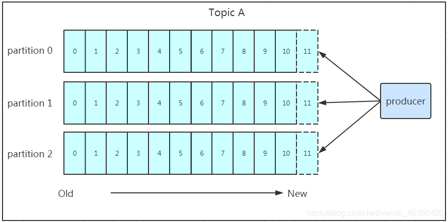
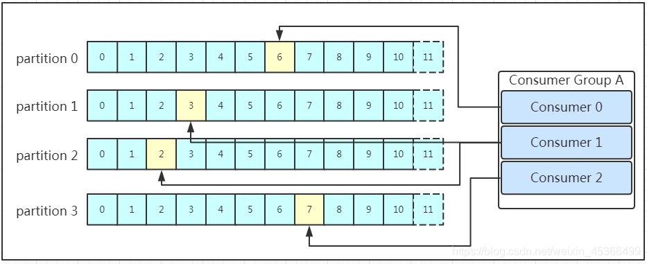
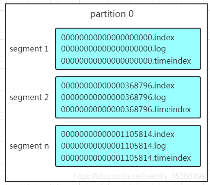

### 简介
- Kafka是最初由Linkedin公司开发，
- 是一个分布式、支持分区的（partition）、多副本的（replica），基于zookeeper协调的分布式消息系统，
- 它的最大的特性就是可以实时的处理大量数据以满足各种需求场景：比如基于hadoop的批处理系统、低延迟的实时系统、storm/Spark流式处理引擎，web/nginx日志、访问日志，消息服务等等，
- 用scala语言编写，Linkedin于2010年贡献给了Apache基金会并成为顶级开源项目。
- Kafka是一种高吞吐量的分布式发布订阅消息系统
- Kafka 是一个分布式流处理平台，主要用于实时数据管道和流处理。它的工作原理主要包括以下几个方面：


### 核心模块
- topic 是为了业务分类，partition 是为了数据的并行消费

#### 1. 生产者（Producer）
生产者，负责向 Kafka 主题（Topic）发布消息。
- 生产者向 Kafka 主题发布消息时，可以指定消息发送到哪个分区（Partition）。如果没有指定分区，Kafka 会使用轮询（Round Robin）或基于消息键的哈希算法来分配分区。
- Producer在写入数据的时候永远的找leader，不会直接将数据写入follower
- 消息写入leader后，follower是主动的去leader进行同步的
- producer采用push模式将数据发布到broker，每条消息追加到分区中，顺序写入磁盘，所以保证同一分区内的数据是有序的


#### 2. 消息存储和分发
每个 Kafka 主题被分为多个分区，每个分区由 Kafka 集群中的一个或多个 Broker 存储。分区具有以下特点：
- **顺序性**：分区中的消息是有序的，每个消息都有一个唯一的偏移量。
- **副本机制**：每个分区可以有多个副本（Replica），副本分布在不同的 Broker 上，以确保高可用性和容错性。

#### 3. 消费者（Consumer）
消费者，从 Kafka 主题订阅并消费消息
- 消费者从 Kafka 主题的一个或多个分区中读取消息。
- 消费者组内的每个消费者负责处理主题中的一个或多个分区，以实现负载均衡和并行处理。
- 每个消费者都属于一个消费者组，且只能属于一个消费者组
- 每个分区只能由消费者组内的一个消费者处理。
- 消费者在拉取消息的时候也是找leader去拉取
- 如果消费者组的消费者多于partition的数量，多出来的消费者不消费任何partition的数据。所以在实际的应用中，建议消费者组的consumer的数量与partition的数量一致！


#### 4. 消费者组
消费者组，Kafka 中的消费者通过消费者组来协调消费消息。


#### 5. Offset 管理
Kafka 通过偏移量（Offset）来跟踪每个分区中消息的消费进度。消费者每次读取消息后，需要提交（Commit）偏移量，以便在故障恢复时能够继续消费未处理的消息。
- **自动提交**：消费者自动提交偏移量，但可能导致消息重复消费或丢失。
- **手动提交**：消费者在处理完消息后手动提交偏移量，提供更灵活的控制。

#### 6. 分区
分区，每个主题可以分为多个分区，分区是 Kafka 的并行度和扩展性的关键。
- 每个topic都可以分为一个或多个partition
- Partition在服务器上的表现形式就是一个一个的文件夹
- 每个partition的文件夹下面会有多组segment文件
  - 每组segment文件又包含.index文件、.log文件、.timeindex文件（早期版本中没有）三个文件，
- log文件就实际是存储message的地方，而index和timeindex文件为索引文件，用于检索消息。
- 每个log文件的大小是一样的，但是存储的message数量是不一定相等的（每条的message大小不一致）。
- 文件的命名是以该segment最小offset来命名的，如000.index存储offset为0~368795的消息，kafka就是利用分段+索引的方式来解决查找效率的问题。


#### 7. follower
- 负责复制领导副本的数据
- 如果领导副本发生故障，Kafka 会自动从跟随副本中选举一个新的领导副本，以确保数据的可用性。
- 配置 unclean.leader.election.enable = false 时，不会从与 leader 同步程度达不到要求的 follower 副本中选择出 leader 
- min.insync.replicas> 1 配置代表消息至少要被写入到 2 个副本才算是被成功发送
- 一般会为 topic 设置 replication.factor >= 3。这样就可以保证每个 分区(partition) 至少有 3 个副本。虽然造成了数据冗余，但是带来了数据的安全性
- 一般推荐设置成 replication.factor = min.insync.replicas + 1
- 每当生产者将新消息写入 leader 副本时，leader 会将这些新消息添加到其日志中，并通知 follower 副本进行同步
- follower 副本会定期向 leader 发送心跳请求，以确认其存活状态并请求新的数据
- follower 副本在接收到数据并成功写入本地日志后，会向 leader 发送确认（ack）。

#### 8. broker
Kafka 集群中的节点，负责存储和传递消息
- 如果某个 Topic 下有 n 个Partition 且集群有 n 个Broker，那么每个 Broker会存储该 Topic 下的一个 Partition
- 如果某个 Topic 下有 n 个Partition 且集群中有 m+n 个Broker，那么只有 n 个Broker会存储该Topic下的一个 Partition
- 如果某个 Topic 下有 n 个Partition 且集群中的Broker数量小于 n，那么一个 Broker 会存储该 Topic 下的一个或多个 Partition，这种情况尽量避免，会导致集群数据不均衡


#### 9. topic
主题，消息的分类和逻辑隔离，类似于消息队列的名称。


#### 10. offset
偏移量，每个分区中的消息都有一个唯一的偏移量，用于标识消息在分区中的位置。


### zookeeper
- Zookeeper 在 Kafka 集群中扮演着协调者和管理者的角色，
- 负责 Broker 注册和发现、分区领导者选举、消费者组协调、偏移量管理、集群配置管理以及元数据管理等任务。
- 通过使用 Zookeeper，Kafka 能够实现高可用性、高可靠性和一致性的数据流处理和存储。
#### 集群管理和协调
1. Broker 注册和发现
- **Broker 注册**：当 Kafka Broker 启动时，它会向 Zookeeper 注册自身的信息，如主机名和端口号。Zookeeper 维护了一个动态更新的 Broker 列表，方便其他组件（如生产者和消费者）发现 Broker。
- **Broker 发现**：生产者和消费者通过 Zookeeper 获取 Kafka 集群中的 Broker 列表，以便于连接和发送/接收消息。
- Broker 注册，也就是 Kafka 节点注册，本质上是在 ZooKeeper 中创建一个专属的目录（又称为节点），其路径为 /brokers

2. Broker 健康监控
- Zookeeper 持续监控各个 Broker 的健康状态。如果一个 Broker 失效（即无法与 Zookeeper 保持心跳），Zookeeper 会将其从活跃 Broker 列表中移除，通知 Kafka 集群进行相应的故障处理。

#### topic 注册
在 Kafka 中，所有 Topic 与 Broker 的对应关系都由 ZooKeeper 来维护，在 ZooKeeper 中，通过建立专属的节点来存储这些信息，其路径为
```shell
/brokers/topics/{topic_name}
```

#### 分区和副本管理
1. 分区领导者选举
- **领导者选举**：每个分区都有一个领导副本（Leader），负责处理读写请求。Zookeeper 负责选举分区的领导副本，并确保每个分区在集群中的唯一领导者。
- **故障切换**：如果领导副本故障，Zookeeper 会选举一个新的领导副本（从跟随副本中选举），确保分区的高可用性和数据一致性。

2. 副本同步状态管理
- Zookeeper 维护着分区副本的同步状态信息，包括哪些副本是同步的（In-Sync Replicas, ISR）。这些信息用于确保数据一致性和在领导者失效时正确选举新的领导者。

#### 消费者组管理
1. 与 Broker、Topic 注册类似，Consumer Group 注册本质上也是在 ZooKeeper 中创建专属的节点，以记录相关信息，其路径为: 
- /consumers/{group_id}
  - ids：Consumer Group 中有多个 Consumer，ids 用于记录这些 Consumer；
  - owners：记录该 Consumer Group 可消费的 Topic 信息
  - offsets：记录 owners 中每个 Topic 的所有 Partition 的 Offset

2. Consumer 注册需在路径 / consumers/{group_id}/ids 下创建专属子节点
- / consumers/{group_id}/ids/my_consumer_for_test-1223234-fdfv1233df23


3. 消费者组协调
- **组协调器**：每个消费者组有一个组协调器（Group Coordinator），负责管理消费者组的成员信息。组协调器的选举和管理由 Zookeeper 负责。
- **分区分配**：消费者组内的消费者通过 Zookeeper 协调，确保每个分区仅由一个消费者处理，避免消息重复消费。

#### 偏移量管理
- **偏移量存储**：Kafka 0.9 及之前版本中，消费者的偏移量存储在 Zookeeper 中。消费者会定期更新自己的消费偏移量，Zookeeper 负责持久化这些偏移量信息。
- 在 Kafka 0.9 之后，偏移量存储移到了 Kafka 自身的特殊 Topic（`__consumer_offsets`）中，但 Zookeeper 仍然在消费者组协调中扮演重要角色。

#### 集群配置管理
- Zookeeper 存储和管理 Kafka 集群的配置信息，包括 Broker 配置、Topic 配置等。管理员可以通过 Zookeeper 动态更新配置，Kafka 集群会实时读取并应用这些配置信息。

#### 元数据管理
- **元数据存储**：Zookeeper 存储 Kafka 集群的元数据信息，如 Topic、分区、副本分配等。这些元数据对于 Kafka 的正常运行和故障恢复至关重要。
- **元数据更新**：当 Kafka 集群中的元数据发生变化（如创建 Topic、增加分区等）时，Zookeeper 会通知相关组件（如 Broker、生产者、消费者）及时更新元数据。

#### 负载均衡
1. producer 负载均衡
如何将消息均衡地 Push 到各个 Partition 呢？这便是 Producers 负载均衡的问题
- Producers 会通过 Watcher 机制监听 Brokers 注册节点的变化。
- 一旦 Brokers 发生变化，如增加、减少，Producers 可以收到通知并更新自己记录的 Broker 列表 。
- Producer 向 Kafka 集群 Push 消息的时候，必须指定 Topic，不过，Partition 却是非必要的
- 不支持指定 Partition，隐藏相关细节，内部则采用轮询、对传入 Key 进行 Hash 等策略将消息数据均衡地发送到各个 Partition

2. consumer 负载均衡
- 在 Consumer 消费消息时，高级别 API 只需指定 Topic 即可，隐藏了负载均衡策略；而低级别的 API 通常需要同时指定 Topic 和 Partition，需要自行实现负载均衡策略。
- 高级别 API 的负载均衡策略需借助 ZooKeeper 实现：
  - 基于 ZooKeeper 提供的 Watcher，Consumer 可以监听同一 Group 中 Consumers 的变化，以及 Broker 列表的变化
  - 进一步，根据 Consumer 列表，将 Partition 排序后，轮流进行分配。由于这是一个动态过程，相应的负载均衡被称为 Rebalance

### 高可用性和扩展性
1. **分区和副本**：
    - Kafka 通过分区实现水平扩展，通过副本实现高可用性。
    - 每个分区有一个 Leader 副本和多个 Follower 副本。生产者和消费者只与 Leader 副本交互，Follower 副本同步 Leader 副本的数据。

2. **故障恢复**：
    - 如果 Leader 副本发生故障，Kafka 会从 Follower 副本中选举一个新的 Leader 副本，确保数据可用性。

3. **分布式协调**：
    - Kafka 使用 ZooKeeper 进行分布式协调，包括 Broker 的注册和发现、分区 Leader 选举、消费者组管理等。

### 怎样保证数据不丢失？
Kafka 是一个分布式流处理平台，为了确保数据不丢失，它提供了多种机制和配置选项。以下是 Kafka 保证数据不丢失的主要方法：

1. 副本机制（Replication）
Kafka 通过分区（Partition）和副本（Replica）机制保证数据不丢失。每个分区都有多个副本，分布在不同的 Kafka 代理（Broker）上。
- **分区（Partition）**：Kafka 将主题（Topic）划分为多个分区，每个分区是一个有序的日志。
- **副本（Replica）**：每个分区的日志可以有多个副本。一个副本被称为领导者（Leader），其余的是跟随者（Follower）。

2. 确认机制（Acknowledgment）
Kafka 生产者在发送消息时，可以配置不同级别的确认机制来保证消息被成功写入。
- **acks=0**：生产者不会等待任何确认。消息发送出去后不管是否成功都不关心，最快，但可能会丢失数据。
- **acks=1**：生产者往集群发送数据只要leader应答就可以发送下一条，只确保leader发送成功。
- **acks=all（或 -1）**：生产者等待所有副本确认消息已写入。这是最安全的设置，确保即使领导者崩溃数据也不会丢失，但速度较慢。

3. ISR（In-Sync Replicas）
ISR 是一个存活并且追上了领导者最新消息的副本集合。Kafka 只有在消息写入所有 ISR 副本后才会确认消息已提交。配置参数 `min.insync.replicas` 确保至少有指定数量的副本在 ISR 中，否则生产者会收到错误。
```properties
min.insync.replicas=2
```

4. 保留消息日志（Log Retention）
配置 `log.retention.ms`、`log.retention.bytes` 和 `log.retention.minutes` 确保消息在一定时间或大小内被保留，防止意外丢失。

5. 生产者重试（Producer Retries）
生产者可以配置重试机制，在写入失败时重新尝试。

```properties
retries=3
```

6. 消费者偏移管理（Consumer Offset Management）
消费者可以使用 Kafka 内置的偏移提交机制，确保消费进度被正确记录。
- **自动提交**：定期提交偏移，但可能会在应用崩溃时丢失数据。
- **手动提交**：消费者在处理完消息后手动提交偏移，确保更精确的控制。

7. 幂等性和事务
- **幂等性（Idempotence）**：启用幂等性确保生产者在重试时不会导致消息重复。可以通过设置 `enable.idempotence=true` 开启。
- **事务（Transactions）**：Kafka 支持事务，确保一组消息作为一个原子操作写入。生产者在发送消息时可以开启事务，确保在事务提交前消息不会被消费。


### 数据保存
#### 写入磁盘
Producer将数据写入kafka后，集群就需要对数据进行保存了！kafka将数据保存在磁盘，可能在我们的一般的认知里，写入磁盘是比较耗时的操作，不适合这种高并发的组件。Kafka初始会单独开辟一块磁盘空间，顺序写入数据（效率比随机写入高）。

#### 存储策略
无论消息是否被消费，kafka都会保存所有的消息。那对于旧数据有什么删除策略呢？
- 基于时间，默认配置是168小时（7天）。
- 基于大小，默认配置是1073741824。

#### message 存储结构
消息主要包含消息体、消息大小、offset、压缩类型……等等！我们重点需要知道的是下面三个：
- offset：offset是一个占8byte的有序id号，它可以唯一确定每条消息在parition内的位置！
- 消息大小：消息大小占用4byte，用于描述消息的大小。
- 消息体：消息体存放的是实际的消息数据（被压缩过），占用的空间根据具体的消息而不一样。

### 高性能原因
Kafka 性能高的原因可以归结为以下几个方面：

#### 1. 顺序写入磁盘
- **顺序写入**：Kafka 将消息以顺序方式写入磁盘，避免了随机写入带来的性能开销。现代磁盘的顺序写入速度非常快，这大大提高了 Kafka 的性能。
- **页缓存**：Kafka 利用操作系统的页缓存，减少了磁盘 I/O 的开销。

#### 2. 分区和并行处理
- **分区（Partitions）**：Kafka 将主题（Topic）划分为多个分区，每个分区可以独立地进行读写操作。这允许 Kafka 实现高并行性，充分利用多核处理器的性能。
- **并行处理**：生产者和消费者可以并行地与不同的分区交互，从而提高数据处理的吞吐量。

#### 3. 批处理（Batching）
- **批处理**：生产者可以将多条消息打包成一个批次进行发送，从而减少网络请求的次数和开销。
- **批量拉取**：消费者可以一次拉取多个消息，减少频繁请求带来的网络延迟。

#### 4. 零拷贝（Zero-Copy）
- **零拷贝**：Kafka 使用零拷贝技术，通过 `sendfile` 系统调用直接将数据从文件系统传输到网络接口，避免了数据在用户态和内核态之间的多次拷贝，从而大大提高了数据传输效率。

#### 5. 高效的存储格式
- **日志段（Log Segments）**：Kafka 将日志划分为多个段，每个段是一个独立的文件。日志段文件可以并行地进行 I/O 操作，提高了磁盘利用率和访问速度。
- **压缩（Compression）**：Kafka 支持消息压缩，减少了数据传输和存储的大小，提高了传输效率。

### 应用场景
- 日志聚合：可收集各种服务的日志写入kafka的消息队列进行存储
- 消息系统：广泛用于消息中间件
- 系统解耦：在重要操作完成后，发送消息，由别的服务系统来完成其他操作
- 流量削峰：一般用于秒杀或抢购活动中，来缓冲网站短时间内高流量带来的压力
- 异步处理：通过异步处理机制，可以把一个消息放入队列中，但不立即处理它，在需要的时候再进行处理


### 总结
Kafka 的设计使其能够在高吞吐量、低延迟、高可用性和可扩展性方面表现出色，适用于各种实时数据处理场景。其核心机制包括主题和分区、生产者和消费者、偏移量管理、副本机制和分布式协调等。通过这些机制，Kafka 实现了高效的数据传输和处理能力。


### 相关链接
- [Kafka基本原理详解（超详细！）](https://blog.csdn.net/weixin_45366499/article/details/106943229)
- [Kafka中Zookeeper的作用](https://developer.baidu.com/article/details/2897784)
- [Kafka 架构中 ZooKeeper 以怎样的形式存在？](https://cloud.tencent.com/developer/article/1799525)