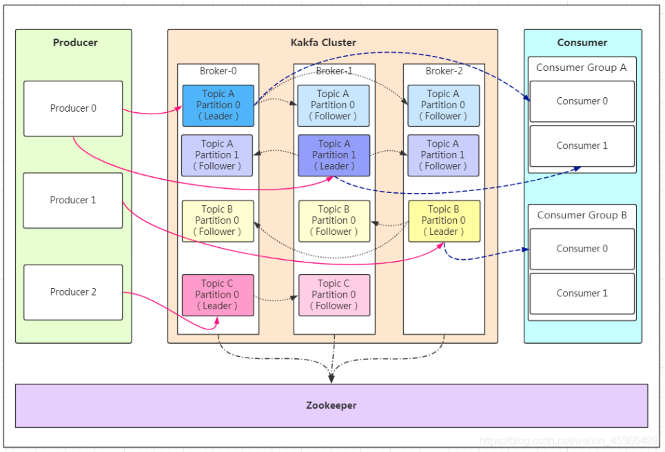
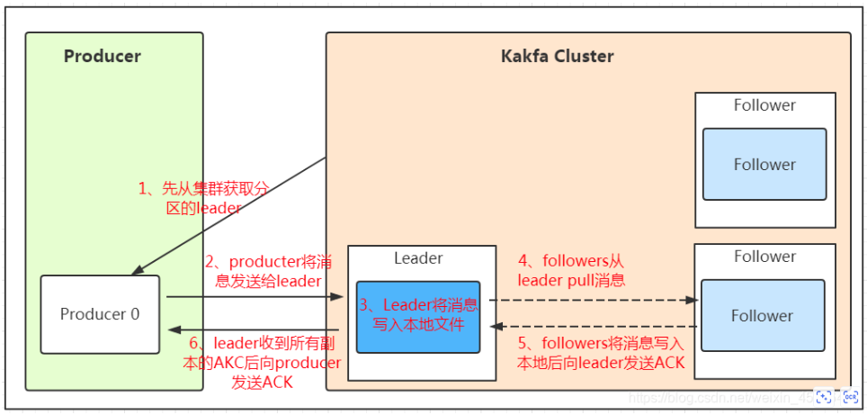

Kafka 是一个分布式流处理平台，主要用于实时数据管道和流处理。它的工作原理主要包括以下几个方面：

### 核心概念

1. **Producer**：生产者，负责向 Kafka 主题（Topic）发布消息。
2. **Consumer**：消费者，从 Kafka 主题订阅并消费消息。
3. **Broker**：Kafka 集群中的节点，负责存储和传递消息。
4. **Topic**：主题，消息的分类和逻辑隔离，类似于消息队列的名称。
5. **Partition**：分区，每个主题可以分为多个分区，分区是 Kafka 的并行度和扩展性的关键。
6. **Offset**：偏移量，每个分区中的消息都有一个唯一的偏移量，用于标识消息在分区中的位置。
7. **Consumer Group**：消费者组，Kafka 中的消费者通过消费者组来协调消费消息。

### 工作流程

#### 1. 生产者（Producer）

生产者向 Kafka 主题发布消息时，可以指定消息发送到哪个分区（Partition）。如果没有指定分区，Kafka 会使用轮询（Round Robin）或基于消息键的哈希算法来分配分区。

#### 2. 消息存储和分发

每个 Kafka 主题被分为多个分区，每个分区由 Kafka 集群中的一个或多个 Broker 存储。分区具有以下特点：

- **顺序性**：分区中的消息是有序的，每个消息都有一个唯一的偏移量。
- **副本机制**：每个分区可以有多个副本（Replica），副本分布在不同的 Broker 上，以确保高可用性和容错性。

#### 3. 消费者（Consumer）

消费者从 Kafka 主题的一个或多个分区中读取消息。消费者组内的每个消费者负责处理主题中的一个或多个分区，以实现负载均衡和并行处理。每个分区只能由消费者组内的一个消费者处理。

#### 4. Offset 管理

Kafka 通过偏移量（Offset）来跟踪每个分区中消息的消费进度。消费者每次读取消息后，需要提交（Commit）偏移量，以便在故障恢复时能够继续消费未处理的消息。

- **自动提交**：消费者自动提交偏移量，但可能导致消息重复消费或丢失。
- **手动提交**：消费者在处理完消息后手动提交偏移量，提供更灵活的控制。

### 高可用性和扩展性

1. **分区和副本**：
    - Kafka 通过分区实现水平扩展，通过副本实现高可用性。
    - 每个分区有一个 Leader 副本和多个 Follower 副本。生产者和消费者只与 Leader 副本交互，Follower 副本同步 Leader 副本的数据。

2. **故障恢复**：
    - 如果 Leader 副本发生故障，Kafka 会从 Follower 副本中选举一个新的 Leader 副本，确保数据可用性。

3. **分布式协调**：
    - Kafka 使用 ZooKeeper 进行分布式协调，包括 Broker 的注册和发现、分区 Leader 选举、消费者组管理等。

### 总结

Kafka 的设计使其能够在高吞吐量、低延迟、高可用性和可扩展性方面表现出色，适用于各种实时数据处理场景。其核心机制包括主题和分区、生产者和消费者、偏移量管理、副本机制和分布式协调等。通过这些机制，Kafka 实现了高效的数据传输和处理能力。

### 相关链接
- [Kafka基本原理详解（超详细！）](https://blog.csdn.net/weixin_45366499/article/details/106943229)