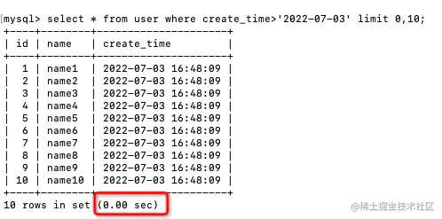
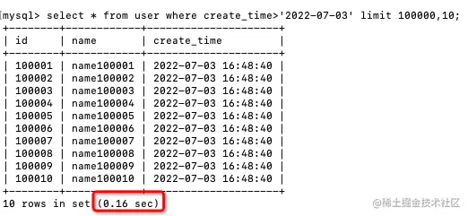
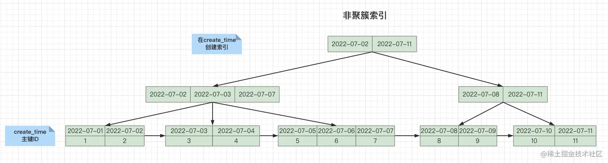
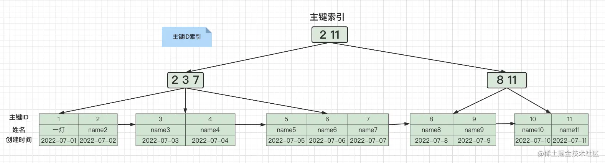
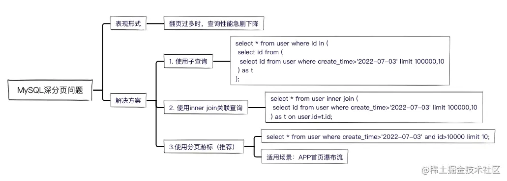
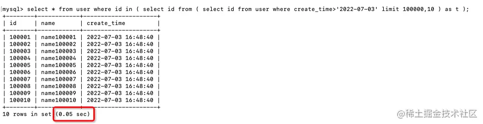
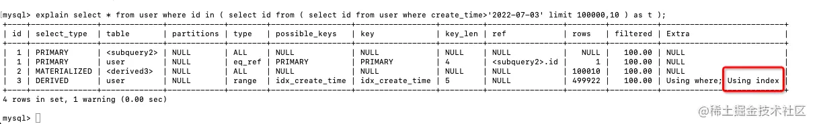
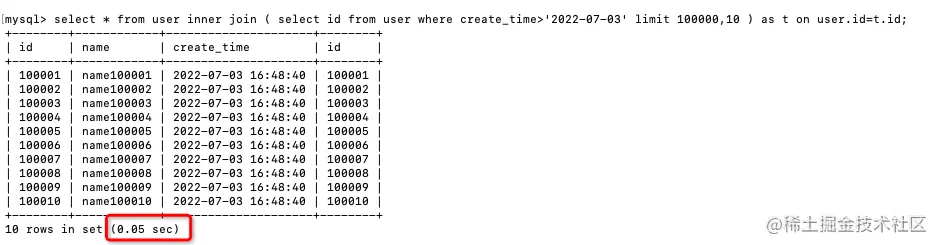
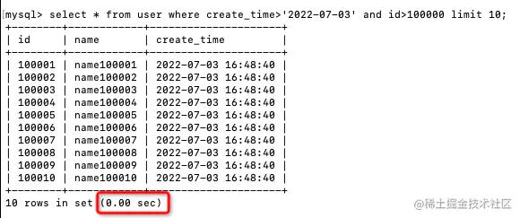

## 问题描述
### 问题
当翻页过多的时候，就会产生深分页，导致查询效率急剧下降

### 准备数据
- 创建一张用户表，只在create_time字段上加索引：
```sql
CREATE TABLE `user` (
  `id` int NOT NULL AUTO_INCREMENT COMMENT '主键',
  `name` varchar(255) DEFAULT NULL COMMENT '姓名',
  `create_time` timestamp NULL DEFAULT NULL COMMENT '创建时间',
  PRIMARY KEY (`id`),
  KEY `idx_create_time` (`create_time`)
) ENGINE=InnoDB COMMENT='用户表';
```
- 插入100万条测试数据
```sql
drop PROCEDURE IF EXISTS insertData;
DELIMITER $$
create procedure insertData()
begin
 declare i int default 1;
   while i <= 100000 do
         INSERT into user (name,create_time) VALUES (CONCAT("name",i), now());
         set i = i + 1; 
   end while; 
end $$
 
call insertData() $$
```

### 查看深度分页问题
- 每页10条，当我们查询第一页的时候，速度很快：
- 在不到0.01秒内直接返回了，所以没显示出执行时间
```sql
select * from user 
where create_time>'2022-07-03' 
limit 0,10;
```


- 当我们翻到第10000页的时候，查询效率急剧下降：
- 执行时间变成了0.16秒，性能至少下降了几十倍。
```sql
select * from user 
where create_time>'2022-07-03' 
limit 100000,10;
```


- 耗时主要花在哪里了？
  - 需要扫描前 100000 条数据，数据量较大，比较耗时
  - create_time 是非聚簇索引，需要先查询出主键 ID，再**回表查询**，通过主键 ID 查询出所有字段
- 回表查询过程：
1. 通过create_time查询出主键ID


2. 再通过主键ID查询出表中所有字段



## 解决方法

### 使用子查询
- 先用子查询查出符合条件的主键，再用主键ID做条件查出所有字段。
```sql
select * from user 
where id in (
  select id from user 
  where create_time>'2022-07-03' 
  limit 100000,10
);

# 这样查询会报错，说是子查询中不支持使用limit
# 加一层子查询嵌套，就可以了
select * from user 
where id in (
 select id from (
    select id from user 
    where create_time>'2022-07-03' 
    limit 100000,10
 ) as t
);
```

- 执行时间缩短到0.05秒，减少了0.12秒，相当于查询性能提升了3倍
- 为什么先用子查询查出符合条件的主键ID，就能缩短查询时间呢？
- 用explain查看一下执行计划


- Extra列显示子查询中用到Using index，表示用到了覆盖索引，所以子查询**无需回表查询**，加快了查询效率
> 索引中已经包含了所有需要获取的字段的查询方式称为覆盖索引

### inner join关联查询
- 把子查询的结果当成一张临时表，然后和原表进行关联查询
- 查询性能跟使用子查询一样。
```sql
select * from user 
inner join (
   select id from user 
    where create_time>'2022-07-03' 
    limit 100000,10
) as t on user.id=t.id;
```


### 使用分页游标（推荐）
- 实现方式就是：当我们查询第二页的时候，把第一页的查询结果放到第二页的查询条件中。

例如：
- 首先查询第一页
```sql
select * from user 
where create_time>'2022-07-03' 
limit 10;
```
- 然后查询第二页，把第一页的查询结果放到第二页查询条件中：
```sql
select * from user 
where create_time>'2022-07-03' and id>10 
limit 10;
```
- 这样相当于每次都是查询第一页，也就不存在深分页的问题了，推荐使用。

- 执行耗时是0秒，查询性能直接提升了几十倍。
- 这样的查询方式虽然好用，但是又带来一个问题，就是无法跳转到指定页数，只能一页页向下翻。
- 所以这种查询只适合特定场景，比如资讯类APP的首页

## sql 字段执行顺序
from -> on -> join -> where -> group by(开始使用select中的别名，后面的语句中都可以使用) -> avg,sum.... -> having -> select -> distinct -> order by -> limit 

## 相关链接
- [查询效率提升10倍！3种优化方案，帮你解决MySQL深分页问题](https://blog.csdn.net/m0_71777195/article/details/125600166)
- [实战！聊聊如何解决MySQL深分页问题](https://juejin.cn/post/7012016858379321358)
- [深度分页介绍及优化建议](https://javaguide.cn/high-performance/deep-pagination-optimization.html)
- [关于sql和MySQL的语句执行顺序(必看)](https://blog.csdn.net/u014044812/article/details/51004754)
